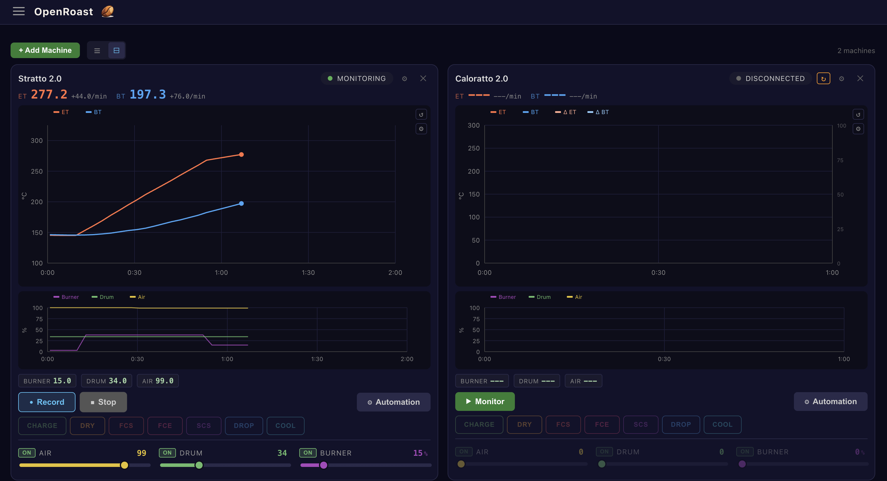
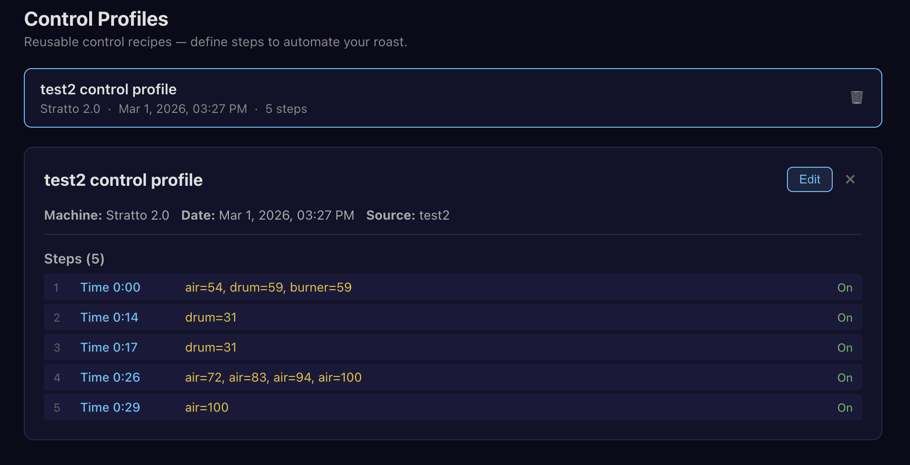
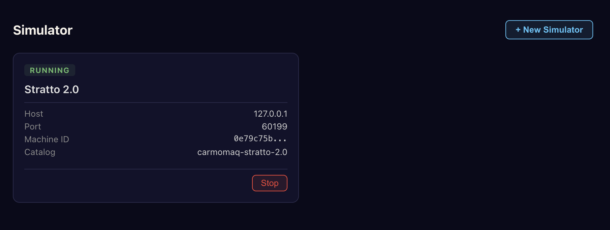

<p align="center">
  
</p>

<h1 align="center">OpenRoast</h1>

<p align="center">
  <strong>Open-source, browser-based coffee roasting software.</strong><br/>
  Connect to your roaster from any device — tablet, phone, or desktop.
</p>

<p align="center">
  <a href="https://github.com/marcandrevigneault/openroast/actions/workflows/ci.yml"></a>
  <a href="https://codecov.io/gh/marcandrevigneault/openroast"></a>
  
  
  
</p>

---

<p align="center">
  
</p>

## Why OpenRoast?

OpenRoast is a modern alternative to [Artisan](https://github.com/artisan-roaster-scope/artisan) built from the ground up as a **web application**. Key differences:

- **Web-based** — runs in any browser, access from your phone, tablet, or any device on your network. No installation needed on client devices.
- **Multi-machine** — monitor and control multiple roasters simultaneously from a single dashboard.
- **Built-in simulators** — develop, test, and train without hardware. Every supported machine has a Modbus simulator you can spin up instantly.
- **Fully tested** — 90%+ code coverage enforced by CI. Every feature ships with unit tests.
- **Easily modifiable** — clean Python/TypeScript codebase with clear module boundaries. Adding a new machine is a JSON catalog entry + driver config.
- **Diagnostic tools** — included Modbus TCP register prober for debugging and reverse-engineering machine protocols.
- **Same automation capabilities** — control profiles, roast event marking, real-time PID, temperature/time alarms.

## Features

### Real-Time Monitoring
Live ET (Environment Temperature) and BT (Bean Temperature) charts streamed over WebSocket with rate-of-rise calculations. Extra channels for burner, drum, and airflow tracking.

### Multi-Machine Control
Connect and control multiple roasters at once. Each machine gets its own panel with independent charts, controls, and session state.

### Machine Controls
Slider controls for burner, drum speed, and airflow with integrated ON/OFF toggles. Standalone toggle buttons for machine power, ignition, cooling tray, and more.

### Roast Event Marking
One-click event buttons: CHARGE, DRY, FCS (First Crack Start), FCE, SCS (Second Crack Start), DROP, COOL. Events are timestamped and overlaid on the chart.

### Automation & Control Profiles
Create reusable control recipes — define timed steps that automatically adjust burner, airflow, and drum settings throughout your roast.

<p align="center">
  
</p>

### Built-In Simulators
Spin up a virtual roaster for any supported machine. Simulators serve realistic Modbus register data so you can develop, test, and train without hardware.

<p align="center">
  
</p>

### Diagnostic Tools
Included Modbus TCP register prober that continuously reads registers and highlights changes in real time — useful for mapping physical controls to register addresses.

```bash
python tools/modbus_prober.py --range 40-69 --interval 0.5 --log
```

## Supported Machines

30 machines from 16 manufacturers, with more being added:

| Manufacturer | Models |
|---|---|
| **Aillio** | Bullet R1 (IBTS), Bullet R2 |
| **Arc** | 800 |
| **Behmor** | 1kg |
| **Besca** | BSC Automatic, BSC Manual |
| **Carmomaq** | Stratto 2.0, Masteratto 2.0, Caloratto 2.0, Speciatto 2.0, Stratto Lab, Caloratto/Materatto Legacy |
| **Coffed** | SR3 (manual), SR5 (automatic), SR5 (manual) |
| **Diedrich** | CR, DR |
| **Giesen** | W6E (electric), WxA (all sizes) |
| **Hottop** | KN-8828B-2K+ |
| **IKAWA** | PRO |
| **Kaleido** | Sniper (Serial) |
| **Loring** | Smart Roast |
| **Mill City Roasters** | Digital Control Panel |
| **Probat** | Probatone |
| **San Franciscan** | SF Eurotherm |
| **Santoker** | Q/X Series (WiFi), R Series (USB) |
| **Toper** | PLC |
| **US Roaster Corp** | RTU |

Adding a new machine requires only a JSON catalog entry with register mappings and control definitions.

## Architecture

```
Browser (SvelteKit)  <— WebSocket + REST —>  Python (FastAPI)  <— Modbus/Serial —>  Roaster
```

- **Backend** — Python FastAPI server handling hardware communication, business logic, roast sessions, and WebSocket broadcasting
- **Frontend** — SvelteKit 5 PWA with real-time charts, machine panels, and control UI
- **Drivers** — Modbus RTU, Modbus TCP, and serial protocols via a pluggable driver abstraction
- **Storage** — SQLite for profiles, sessions, and configuration

## Quick Start

### Backend

```bash
cd backend
python -m venv .venv && source .venv/bin/activate
pip install -e ".[dev]"
uvicorn openroast.main:app --reload
```

### Frontend

```bash
cd frontend
npm install
npm run dev
```

Open [http://localhost:5173](http://localhost:5173) in your browser.

### Desktop App

Pre-built binaries for macOS and Windows are available on the [Releases](https://github.com/marcandrevigneault/openroast/releases) page. The desktop app runs the backend as a system tray application and opens the UI in your default browser.

## Running Tests

```bash
# Backend (90%+ coverage enforced)
cd backend && python -m pytest tests/ -v --cov=openroast

# Frontend
cd frontend && npm test
```

## Contributing

See [CLAUDE.md](CLAUDE.md) for coding conventions, branch workflow, and module boundaries.

Every PR requires all tests passing, 90%+ backend coverage, and clean lints.

## License

MIT
